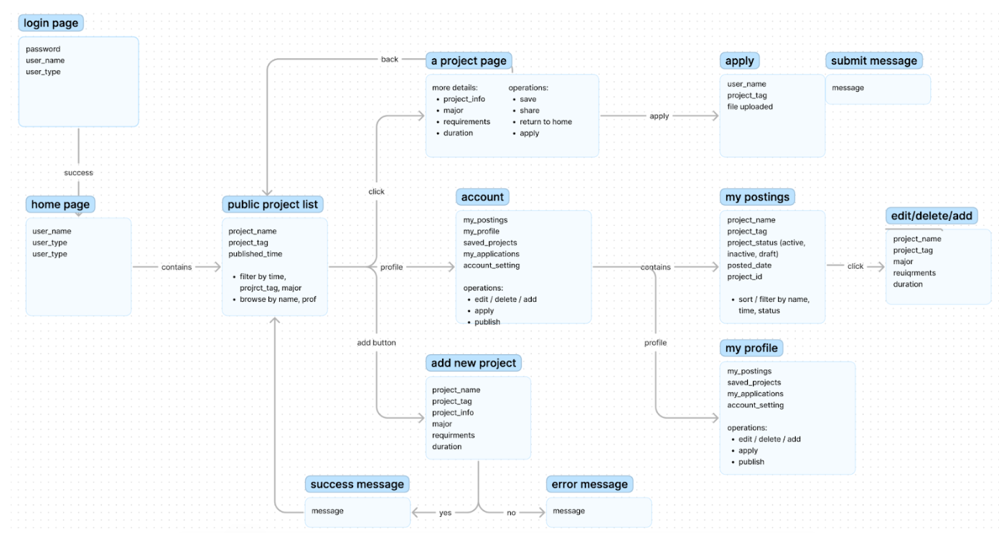

# SWE project Fall 2022
A flask rest API server, for NYU project finder website.

## Tech Stack used for this project:

Testing: pytest

Server: Flask && flask-restx

Lint: flake8

Database: MongoDB

CI/CD: Github Action

Cloud deployment: Heroku

Backend deployed to Heroku at https://project-finder.herokuapp.com/

Frontend deployed to Heroku at https://project-matcher.herokuapp.com/

Backend Github Link: https://github.com/BowenGong2000/swe_project

Frontend Github Link: https://github.com/FantasiA10/Project-matcher

## Access Locally: 

1. install pymongo `pip install pymongo`
2. install pymongo[srv] `pip install "pymongo[srv]"`
3. install passlib for password encyption `pip install passlib`
4. run command `./local.sh`      
5. Go to http://127.0.0.1:8000

NOTE: 
To run `make prod`, you need to set MONGO_PW locally. `export MONGO_PW=1234`
To build production, type `make prod`.
To create the env for a new developer, run `make dev_env`.

## Requirements

### User endpoints:
- Signup (add a user)
- Login (verify credentials)
- Get info of a user
- List all registered users
- Delete a user
- Edit/Update user info
- Edit profile photo

### Projects endpoints:
- List all available projects
- Get info of a project
- Create a project
- Delete a project
- Approve a project (admin only)
- Upload and download project files
- Get website statitstics

### Application endpoints:
- List all applications of a user
- Get info of a application
- Create a application for a specific project
- Send user email notifications
- Cancel/Delete a application
- Upload and download resume, transcript, coverletter etc.
- Get applications by filters (by user_email / by project_name)
- View applicants

### Flow Chart:

resources of code for UI:
head protray https://www.deviantart.com/karmaanddestiny/art/Default-user-icon-4-858661084
form comtribution: https://github.com/JeetSaru/Responsive-HTML-Table-With-Pure-CSS---Web-Design-UI-Design

